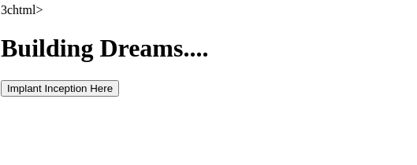
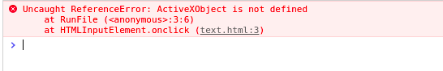
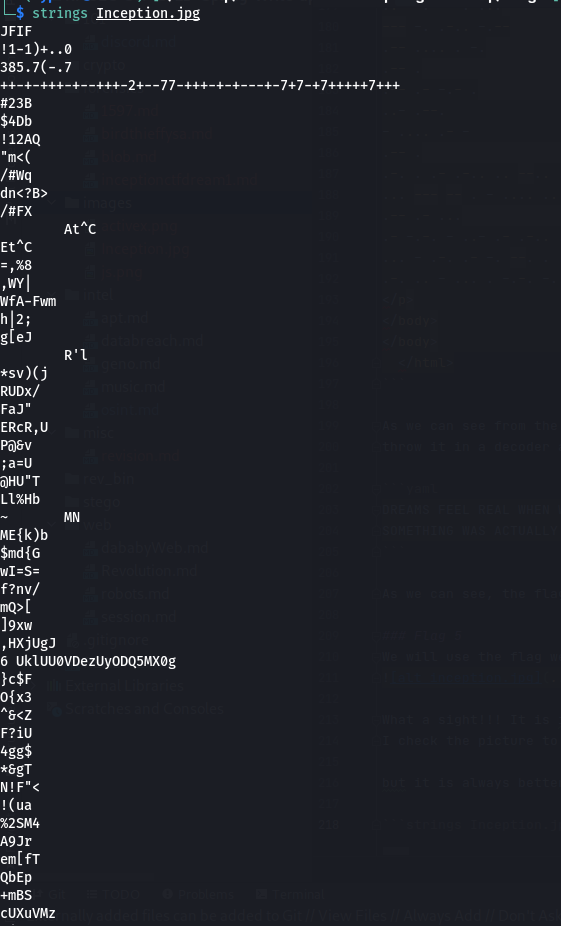

# Inception CTF: Dream 1
# Points: 100

# Description
Inception CTF: Dream 1
100
The purpose of this CTF challenge is to identify common methods of hiding malicious files and code. In most cases adversaries will attempt to evade defenses in many cases by masquerading, hiding files, and more. There are five directories like the five levels in the movie Inception, Reality -> Van Chase -> The Hotel -> Snow Fortress -> Limbo. You will find one flag in each of the levels, that flag will also be the password to extract the next directory. Requirements: • You must have 7zip installed • Drop the InceptionCTF.7z on the Desktop as “InceptionCTF” • Use the option “Extract to "<name of directory>\” for the CTF to function properly Missing either of the above may result in complications which may cause issues when attempting to find flags.

NOTE: These challenges have a flag format of RITSEC{}

Dream 1: We have to get to their subconscious first, look for a hidden text file within the directory “Reality” this flag will unlock the next directory.

# Solution
For this particular challenge, we download a .7z file which according to the description has another zips within it,
just like the movie inception!

First I unzip the inception file with 7zip and was presented with other 7z file called Reality.
After unzip that file, there was a subconscious.txt file which contain the flag backward as {dnalmaerD}CESTIR

### Flag 1
```RITSEC{Dreamland}``` this is the reverse of the file that we found in subconcious.txt
We will use this flaz to open VanChase.7z without RITSEC{ }

### Flag 2
Once unlocked the vanchase we see couple more files, a powershell file, kidnap.txt and TheHotel.7z
When we open kidnap.txt we see a hex and by throwing it into a hex decoder we get this flag
RITSEC{WaterUnderTheBridge}

### Flag 3
After unlock TheHotel zip with the flag #2, we are then presented with an unknown file, snowFortress.7z and ThePointMan.txt

The pointman file turned out to contain several different kind of encryptions/encoded ciphertexts,
after solving each using base64 decoder, hexdecoder, bxor, subtitution cipher, morse code
```yaml
Q3JlYXRlIGEgbWF6ZSBpbiB0d28gbWludXRlcyB0aGF0IHRha2VzIG1lIG9uZSBtdW5pdGUgdG8gc29sdmUuIA==

59 6f 75 27 72 65 20 77 61 69 74 69 6e 67 20 66 6f 72 20 61 20 74 72 61 69 6e 2c 20 61 20 74 72 61 69 6e 20 74 68 61 74 20 77 69 6c 6c 20 74 61 6b 65 20 79 6f 75 20 66 61 72 20 61 77 61 79 2e 20 59 6f 75 20 6b 6e 6f 77 20 77 68 65 72 65 20 79 6f 75 20 68 6f 70 65 20 74 68 69 73 20 74 72 61 69 6e 20 77 69 6c 6c 20 74 61 6b 65 20 79 6f 75 2c 20 62 75 74 20 79 6f 75 20 63 61 6e 27 74 20 62 65 20 73 75 72 65 2e 20 62 75 74 20 69 74 20 64 6f 65 73 6e 27 74 20 6d 61 74 74 65 72 20 2d 20 62 65 63 61 75 73 65 20 77 65 27 6c 6c 20 62 65 20 74 6f 67 65 74 68 65 72 2e 20

|JP.HPVK.Q.G@.DCWDLA.QJ.AW@DH.GLBB@W	.aDWILKB. BXOR 25

Gung znal qernzf jvguva qernzf vf gbb hafgnoyr!

--. ..- .-.
..-. .-. .-. --.-
--. ..- -. --.
.--- .-.
-.-. -.-- -. .- --. .-. --.-
...- .-
--. ..- ...- ..-.
--.. -. .- .----. ..-.
--.. ...- .- --.-
--.. -. .-..
.--. ..- -. .- - .-.
.-. .. .-. . .-.. --. ..- ...- .- - .-.-.-

No place for a tourist in this job.
```

each was just a phrase from the inception movie and didnt contain any flag... hello distraction :-)

Moving on to the unknown file, 

when we open it, we are presented with this,
```yaml
You mean, a dream within a dream? 
NTIgNDkgNTQgNTMgNDUgNDMgN2IgNDYgNDAgMjEgMjEgNjkgNmUgNjcgNDUgNmMgNjUgNzYgNDAgNzQgNmYgNzIgN2Q=
```
We throw the ciphertext in a base64 decoder then we got a hex as follow
```html
52 49 54 53 45 43 7b 46 40 21 21 69 6e 67 45 6c 65 76 40 74 6f 72 7d
```

We then decoded that in an hex decoder and was presented with the flag
```RITSEC{F@!!ingElev@tor}```

### Flag 4
Using the flag we obtained above, we then move to unlock the SnowFortress.7z file
and we are then of course presented with another 7z file! We got  Limbo.7z and PasswordPath.exe

Given that my machine is linux, at first I thought I had to run the PasswordPath.exe so I fired up wine
but wine was having difficult opening the file so I ran the strings <filename> on the terminal
and I noticed that it was not a really PasswordPath.exe as the name implies. When I ran strings then tab it shows up as

```
strings PasswordP<202e>exe.hta
```
After viewing through the contents on the terminal after running the strings commands above,
I decided that the interesting section was

```html
<script language="javascript">document.write(unescape('3c%68%74%6d%6c%3e%0a%3c%62%6f%64%79%3e%0a%0a%3c%21%44%4f' +
        '%43%54%59%50%45%20%68%74%6d%6c%3e%0a%3c%68%74%6d%6c%3e%0a%3c%68%65%61%64%3e%0a%20%20%20%20%3c%74' +
        '%69%74%6c%65%3e%4e%6f%6e%2c%20%6a%65%20%6e%65%20%72%65%67%72%65%74%74%65%20%72%69%65%6e%3c%2f%74%6' +
        '9%74%6c%65%3e%0a%3c%48%54%41%3a%41%50%50%4c%49%43%41%54%49%4f%4e%0a%20%20%41%50%50%4c%49%43%41%54%4' +
        '9%4f%4e%4e%41%4d%45%3d%22%4e%6f%6e%2c%20%6a%65%20%6e%65%20%72%65%67%72%65%74%74%65%20%72%69%65%6e%22%0' +
        'a%20%20%49%44%3d%22%49%6e%63%65%70%74%69%6f%6e%22%0a%20%20%56%45%52%53%49%4f%4e%3d%22%31%2e%30%22%0a%2' +
        '0%20%53%43%52%4f%4c%4c%3d%22%6e%6f%22%2f%3e%0a%20%0a%3c%73%74%79%6c%65%20%74%79%70' +
        '%65%3d%22%74%65%78%74%2f%63%73%73%22%3e%0a%3c%2f%68%65%61%64%3e%0a%20%20%20%20%3c%64' +
        '%69%76%20%69%64%3d%22%66%65%61%74%75%72%65%22%3e%0a%20%20%20%20%20%20%20%20%20%20%20%20%3c' +
        '%64%69%76%20%69%64%3d%22%63%6f%6e%74%65%6e%74%0a%09%09%09%09%3c%2f%73%74%79%6c%65%3e%0a%20%2' +
        '0%20%20%20%20%20%20%20%20%20%20%20%20%20%20%3c%68%31%20%69%64%3d%22%75%6e%61%76%61%69%6c%61%62' +
        '%6c%65%22%20%63%6c%61%73%73%3d%22%6c%6f%61%64%69%6e%67%22%3e%42%75%69%6c%64%69%6e%67%20%44%72%6' +
        '5%61%6d%73%2e%2e%2e%2e%3c%2f%68%31%3e%0a%09%09%09%09%3c%73%63%72%69%70%74%20%74%79%70%65%3d%22%' +
        '74%65%78%74%2f%6a%61%76%61%73%63%72%69%70%74%22%20%6c%61%6e%67%75%61%67%65%3d%22%6a%61%76%61%73' +
        '%63%72%69%70%74%22%3e%0a%09%09%09%09%09%66%75%6e%63%74%69%6f%6e%20%52%75%6e%46%69%6c%65%28%29%20' +
        '%7b%0a%09%09%09%09%09%57%73%68%53%68%65%6c%6c%20%3d%20%6e%65%77%20%41%63%74%69%76%65%58%4f%62%6a' +
        '%65%63%74%28%22%57%53%63%72%69%70%74%2e%53%68%65%6c%6c%22%29%3b%0a%09%09%09%09%09%57%73%68%53%68' +
        '%65%6c%6c%2e%52%75%6e%28%22%6e%6f%74%65%70%61%64%20%25%55%53%45%52%50%52%4f%46%49%4c%45%25%2f%44' +
        '%65%73%6b%74%6f%70%2f%49%6e%63%65%70%74%69%6f%6e%43%54%46%2f%52%65%61%6c%69%74%79%2f%56%61%6e%43' +
        '%68%61%73%65%2f%54%68%65%48%6f%74%65%6c%2f%54%68%65%50%6f%69%6e%74%4d%61%6e%2e%74%78%74%22%2c%20' +
        '%31%2c%20%66%61%6c%73%65%29%3b%0a%09%09%09%09%09%7d%0a%09%09%09%09%3c%2f%73%63%72%69%70%74%3e%0a' +
        '%20%20%20%20%20%20%20%20%3c%2f%64%69%76%3e%0a%20%20%20%20%3c%2f%64%69%76%3e%0a%3c%62%6f%64%79%3e' +
        '%0a%09%3c%69%6e%70%75%74%20%74%79%70%65%3d%22%62%75%74%74%6f%6e%22%20%76%61%6c%75%65%3d%22%49%6d' +
        '%70%6c%61%6e%74%20%49%6e%63%65%70%74%69%6f%6e%20%48%65%72%65%22%20%6f%6e%63%6c%69%63%6b%3d%22%52' +
        '%75%6e%46%69%6c%65%28%29%3b%22%2f%3e%0a%09%3c%70%20%73%74%79%6c%65%3d%22%63%6f%6c%6f%72%3a%77%68%69%' +
        '74%65%3b%22%3e%0a%2d%2e%2e%20%2e%2d%2e%20%2e%20%2e%2d%20%2d%2d%20%2e%2e%2e%0a%2e%2e%2d%2e%20%2e%20%2' +
        'e%20%2e%2d%2e%2e%0a%2e%2d%2e%20%2e%20%2e%2d%20%2e%2d%2e%2e%0a%2e%2d%2d%20%2e%2e%2e%2e%20%2e%20%2d%2e' +
        '%0a%2e%2d%2d%20%2e%20%2e%2d%2d%2d%2d%2e%20%2e%2d%2e%20%2e%0a%2e%2e%20%2d%2e%0a%2d%20%2e%2e%2e%2e%20%' +
        '2e%20%2d%2d%20%2e%2d%2e%2d%2e%2d%0a%2e%2e%20%2d%20%2e%2d%2d%2d%2d%2e%20%2e%2e%2e%0a%2d%2d%2d%20%2d%' +
        '2e%20%2e%2d%2e%2e%20%2d%2e%2d%2d%0a%2e%2d%2d%20%2e%2e%2e%2e%20%2e%20%2d%2e%0a%2e%2d%2d%20%2e%0a%2e%' +
        '2d%2d%20%2e%2d%20%2d%2e%2d%20%2e%0a%2e%2e%2d%20%2e%2d%2d%2e%0a%2d%20%2e%2e%2e%2e%20%2e%2d%20%2d%0a%2' +
        'e%2d%2d%20%2e%0a%2e%2d%2e%20%2e%20%2e%2d%20%2e%2d%2e%2e%20%2e%2e%20%2d%2d%2e%2e%20%2e%0a%2e%2e%2e%20%' +
        '2d%2d%2d%20%2d%2d%20%2e%20%2d%20%2e%2e%2e%2e%20%2e%2e%20%2d%2e%20%2d%2d%2e%0a%2e%2d%2d%20%2e%2d%20%2e%' +
        '2e%2e%0a%2e%2d%20%2d%2e%2d%2e%20%2d%20%2e%2e%2d%20%2e%2d%20%2e%2d%2e%2e%20%2e%2d%2e%2e%20%2d%2e%2d%2d%' +
        '0a%2e%2e%2e%20%2d%20%2e%2d%2e%20%2e%2d%20%2d%2e%20%2d%2d%2e%20%2e%20%2e%2d%2e%2d%2e%2d%0a%2e%2d%2e%20%' +
        '2e%2e%20%2d%20%2e%2e%2e%20%2e%20%2d%2e%2d%2e%20%2d%2e%2e%2e%2d%20%2d%2e%2e%20%2e%2e%20%2e%2e%2e%2d%20%' +
        '2e%20%2e%2d%2e%20%2e%2e%2e%20%2e%2e%20%2d%2d%2d%20%2d%2e%20%0a%3c%2f%70%3e%0a%3c%2f%62%6f%64%79%3e%0a%' +
        '3c%2f%62%6f%64%79%3e%0a%20%20%3c%2f%68%74%6d%6c%3e' +
        ''));</script>
```
I thought well probably I could just take out that section and save it as html after all it is javascript and I got this result
. I was feeling proud of myself... until I hit the "Implant Inception Here button"
and was hit with an error


After googling a bit, I discovered that ActiveXObject only support in... drumroll.... Internet Explorer :-(
afterall this is suppose to be an .exe. I was sure not going to download IE so I take a closer look at the js section again and 
I realized that they were hexcode!! That is right, copy out the hex and throw them in [hex decoder](https://gchq.github.io/CyberChef/#recipe=From_Hex('Auto')&input=M2MlNjglNzQlNmQlNmMlM2UlMGElM2MlNjIlNmYlNjQlNzklM2UlMGElMGElM2MlMjElNDQlNGYlNDMlNTQlNTklNTAlNDUlMjAlNjglNzQlNmQlNmMlM2UlMGElM2MlNjglNzQlNmQlNmMlM2UlMGElM2MlNjglNjUlNjElNjQlM2UlMGElMjAlMjAlMjAlMjAlM2MlNzQlNjklNzQlNmMlNjUlM2UlNGUlNmYlNmUlMmMlMjAlNmElNjUlMjAlNmUlNjUlMjAlNzIlNjUlNjclNzIlNjUlNzQlNzQlNjUlMjAlNzIlNjklNjUlNmUlM2MlMmYlNzQlNjklNzQlNmMlNjUlM2UlMGElM2MlNDglNTQlNDElM2ElNDElNTAlNTAlNGMlNDklNDMlNDElNTQlNDklNGYlNGUlMGElMjAlMjAlNDElNTAlNTAlNGMlNDklNDMlNDElNTQlNDklNGYlNGUlNGUlNDElNGQlNDUlM2QlMjIlNGUlNmYlNmUlMmMlMjAlNmElNjUlMjAlNmUlNjUlMjAlNzIlNjUlNjclNzIlNjUlNzQlNzQlNjUlMjAlNzIlNjklNjUlNmUlMjIlMGElMjAlMjAlNDklNDQlM2QlMjIlNDklNmUlNjMlNjUlNzAlNzQlNjklNmYlNmUlMjIlMGElMjAlMjAlNTYlNDUlNTIlNTMlNDklNGYlNGUlM2QlMjIlMzElMmUlMzAlMjIlMGElMjAlMjAlNTMlNDMlNTIlNGYlNGMlNGMlM2QlMjIlNmUlNmYlMjIlMmYlM2UlMGElMjAlMGElM2MlNzMlNzQlNzklNmMlNjUlMjAlNzQlNzklNzAlNjUlM2QlMjIlNzQlNjUlNzglNzQlMmYlNjMlNzMlNzMlMjIlM2UlMGElM2MlMmYlNjglNjUlNjElNjQlM2UlMGElMjAlMjAlMjAlMjAlM2MlNjQlNjklNzYlMjAlNjklNjQlM2QlMjIlNjYlNjUlNjElNzQlNzUlNzIlNjUlMjIlM2UlMGElMjAlMjAlMjAlMjAlMjAlMjAlMjAlMjAlMjAlMjAlMjAlMjAlM2MlNjQlNjklNzYlMjAlNjklNjQlM2QlMjIlNjMlNmYlNmUlNzQlNjUlNmUlNzQlMGElMDklMDklMDklMDklM2MlMmYlNzMlNzQlNzklNmMlNjUlM2UlMGElMjAlMjAlMjAlMjAlMjAlMjAlMjAlMjAlMjAlMjAlMjAlMjAlMjAlMjAlMjAlMjAlM2MlNjglMzElMjAlNjklNjQlM2QlMjIlNzUlNmUlNjElNzYlNjElNjklNmMlNjElNjIlNmMlNjUlMjIlMjAlNjMlNmMlNjElNzMlNzMlM2QlMjIlNmMlNmYlNjElNjQlNjklNmUlNjclMjIlM2UlNDIlNzUlNjklNmMlNjQlNjklNmUlNjclMjAlNDQlNzIlNjUlNjElNmQlNzMlMmUlMmUlMmUlMmUlM2MlMmYlNjglMzElM2UlMGElMDklMDklMDklMDklM2MlNzMlNjMlNzIlNjklNzAlNzQlMjAlNzQlNzklNzAlNjUlM2QlMjIlNzQlNjUlNzglNzQlMmYlNmElNjElNzYlNjElNzMlNjMlNzIlNjklNzAlNzQlMjIlMjAlNmMlNjElNmUlNjclNzUlNjElNjclNjUlM2QlMjIlNmElNjElNzYlNjElNzMlNjMlNzIlNjklNzAlNzQlMjIlM2UlMGElMDklMDklMDklMDklMDklNjYlNzUlNmUlNjMlNzQlNjklNmYlNmUlMjAlNTIlNzUlNmUlNDYlNjklNmMlNjUlMjglMjklMjAlN2IlMGElMDklMDklMDklMDklMDklNTclNzMlNjglNTMlNjglNjUlNmMlNmMlMjAlM2QlMjAlNmUlNjUlNzclMjAlNDElNjMlNzQlNjklNzYlNjUlNTglNGYlNjIlNmElNjUlNjMlNzQlMjglMjIlNTclNTMlNjMlNzIlNjklNzAlNzQlMmUlNTMlNjglNjUlNmMlNmMlMjIlMjklM2IlMGElMDklMDklMDklMDklMDklNTclNzMlNjglNTMlNjglNjUlNmMlNmMlMmUlNTIlNzUlNmUlMjglMjIlNmUlNmYlNzQlNjUlNzAlNjElNjQlMjAlMjUlNTUlNTMlNDUlNTIlNTAlNTIlNGYlNDYlNDklNGMlNDUlMjUlMmYlNDQlNjUlNzMlNmIlNzQlNmYlNzAlMmYlNDklNmUlNjMlNjUlNzAlNzQlNjklNmYlNmUlNDMlNTQlNDYlMmYlNTIlNjUlNjElNmMlNjklNzQlNzklMmYlNTYlNjElNmUlNDMlNjglNjElNzMlNjUlMmYlNTQlNjglNjUlNDglNmYlNzQlNjUlNmMlMmYlNTQlNjglNjUlNTAlNmYlNjklNmUlNzQlNGQlNjElNmUlMmUlNzQlNzglNzQlMjIlMmMlMjAlMzElMmMlMjAlNjYlNjElNmMlNzMlNjUlMjklM2IlMGElMDklMDklMDklMDklMDklN2QlMGElMDklMDklMDklMDklM2MlMmYlNzMlNjMlNzIlNjklNzAlNzQlM2UlMGElMjAlMjAlMjAlMjAlMjAlMjAlMjAlMjAlM2MlMmYlNjQlNjklNzYlM2UlMGElMjAlMjAlMjAlMjAlM2MlMmYlNjQlNjklNzYlM2UlMGElM2MlNjIlNmYlNjQlNzklM2UlMGElMDklM2MlNjklNmUlNzAlNzUlNzQlMjAlNzQlNzklNzAlNjUlM2QlMjIlNjIlNzUlNzQlNzQlNmYlNmUlMjIlMjAlNzYlNjElNmMlNzUlNjUlM2QlMjIlNDklNmQlNzAlNmMlNjElNmUlNzQlMjAlNDklNmUlNjMlNjUlNzAlNzQlNjklNmYlNmUlMjAlNDglNjUlNzIlNjUlMjIlMjAlNmYlNmUlNjMlNmMlNjklNjMlNmIlM2QlMjIlNTIlNzUlNmUlNDYlNjklNmMlNjUlMjglMjklM2IlMjIlMmYlM2UlMGElMDklM2MlNzAlMjAlNzMlNzQlNzklNmMlNjUlM2QlMjIlNjMlNmYlNmMlNmYlNzIlM2ElNzclNjglNjklNzQlNjUlM2IlMjIlM2UlMGElMmQlMmUlMmUlMjAlMmUlMmQlMmUlMjAlMmUlMjAlMmUlMmQlMjAlMmQlMmQlMjAlMmUlMmUlMmUlMGElMmUlMmUlMmQlMmUlMjAlMmUlMjAlMmUlMjAlMmUlMmQlMmUlMmUlMGElMmUlMmQlMmUlMjAlMmUlMjAlMmUlMmQlMjAlMmUlMmQlMmUlMmUlMGElMmUlMmQlMmQlMjAlMmUlMmUlMmUlMmUlMjAlMmUlMjAlMmQlMmUlMGElMmUlMmQlMmQlMjAlMmUlMjAlMmUlMmQlMmQlMmQlMmQlMmUlMjAlMmUlMmQlMmUlMjAlMmUlMGElMmUlMmUlMjAlMmQlMmUlMGElMmQlMjAlMmUlMmUlMmUlMmUlMjAlMmUlMjAlMmQlMmQlMjAlMmUlMmQlMmUlMmQlMmUlMmQlMGElMmUlMmUlMjAlMmQlMjAlMmUlMmQlMmQlMmQlMmQlMmUlMjAlMmUlMmUlMmUlMGElMmQlMmQlMmQlMjAlMmQlMmUlMjAlMmUlMmQlMmUlMmUlMjAlMmQlMmUlMmQlMmQlMGElMmUlMmQlMmQlMjAlMmUlMmUlMmUlMmUlMjAlMmUlMjAlMmQlMmUlMGElMmUlMmQlMmQlMjAlMmUlMGElMmUlMmQlMmQlMjAlMmUlMmQlMjAlMmQlMmUlMmQlMjAlMmUlMGElMmUlMmUlMmQlMjAlMmUlMmQlMmQlMmUlMGElMmQlMjAlMmUlMmUlMmUlMmUlMjAlMmUlMmQlMjAlMmQlMGElMmUlMmQlMmQlMjAlMmUlMGElMmUlMmQlMmUlMjAlMmUlMjAlMmUlMmQlMjAlMmUlMmQlMmUlMmUlMjAlMmUlMmUlMjAlMmQlMmQlMmUlMmUlMjAlMmUlMGElMmUlMmUlMmUlMjAlMmQlMmQlMmQlMjAlMmQlMmQlMjAlMmUlMjAlMmQlMjAlMmUlMmUlMmUlMmUlMjAlMmUlMmUlMjAlMmQlMmUlMjAlMmQlMmQlMmUlMGElMmUlMmQlMmQlMjAlMmUlMmQlMjAlMmUlMmUlMmUlMGElMmUlMmQlMjAlMmQlMmUlMmQlMmUlMjAlMmQlMjAlMmUlMmUlMmQlMjAlMmUlMmQlMjAlMmUlMmQlMmUlMmUlMjAlMmUlMmQlMmUlMmUlMjAlMmQlMmUlMmQlMmQlMGElMmUlMmUlMmUlMjAlMmQlMjAlMmUlMmQlMmUlMjAlMmUlMmQlMjAlMmQlMmUlMjAlMmQlMmQlMmUlMjAlMmUlMjAlMmUlMmQlMmUlMmQlMmUlMmQlMGElMmUlMmQlMmUlMjAlMmUlMmUlMjAlMmQlMjAlMmUlMmUlMmUlMjAlMmUlMjAlMmQlMmUlMmQlMmUlMjAlMmQlMmUlMmUlMmUlMmQlMjAlMmQlMmUlMmUlMjAlMmUlMmUlMjAlMmUlMmUlMmUlMmQlMjAlMmUlMjAlMmUlMmQlMmUlMjAlMmUlMmUlMmUlMjAlMmUlMmUlMjAlMmQlMmQlMmQlMjAlMmQlMmUlMjAlMGElM2MlMmYlNzAlM2UlMGElM2MlMmYlNjIlNmYlNjQlNzklM2UlMGElM2MlMmYlNjIlNmYlNjQlNzklM2UlMGElMjAlMjAlM2MlMmYlNjglNzQlNmQlNmMlM2U)
and we get a nice looking result

```html
<html>
<body>

<!DOCTYPE html>
<html>
<head>
    <title>Non, je ne regrette rien</title>
<HTA:APPLICATION
  APPLICATIONNAME="Non, je ne regrette rien"
  ID="Inception"
  VERSION="1.0"
  SCROLL="no"/>
 
<style type="text/css">
</head>
    <div id="feature">
            <div id="content
				</style>
                <h1 id="unavailable" class="loading">Building Dreams....</h1>
				<script type="text/javascript" language="javascript">
					function RunFile() {
					WshShell = new ActiveXObject("WScript.Shell");
					WshShell.Run("notepad %USERPROFILE%/Desktop/InceptionCTF/Reality/VanChase/TheHotel/ThePointMan.txt", 1, false);
					}
				</script>
        </div>
    </div>
<body>
	<input type="button" value="Implant Inception Here" onclick="RunFile();"/>
	<p style="color:white;">
-.. .-. . .- -- ...
..-. . . .-..
.-. . .- .-..
.-- .... . -.
.-- . .----. .-. .
.. -.
- .... . -- .-.-.-
.. - .----. ...
--- -. .-.. -.--
.-- .... . -.
.-- .
.-- .- -.- .
..- .--.
- .... .- -
.-- .
.-. . .- .-.. .. --.. .
... --- -- . - .... .. -. --.
.-- .- ...
.- -.-. - ..- .- .-.. .-.. -.--
... - .-. .- -. --. . .-.-.-
.-. .. - ... . -.-. -...- -.. .. ...- . .-. ... .. --- -. 
</p>
</body>
</body>
  </html>
```

As we can see from the snippet above, we got another decoding to do!! but this time it is just morse code, so we can just
throw it in a decoder again... after all that is what we have been doing right?! After decoding, we get a nice looking message + FLAG!!

```yaml
DREAMS FEEL REAL WHEN WE'RE IN THEM. IT'S ONLY WHEN WE WAKE UP THAT WE REALIZE 
SOMETHING WAS ACTUALLY STRANGE. RITSEC=DIVERSION
```

As we can see, the flag is RITSEC=DIVERSION

### Flag 5
We will use the flag we obtained above to open the Limbo.7z. After opening, we got inception.jpg


What a sight!!! It is inception after all. However we are not done. There is a..... flag somewhere :-)
I check the picture to see if there is any flag but there was not any. I thought maybe it is hidden within the image itself

but it is always better to start simple so I went to the terminal and use string to see what are the contents within the image

```strings Inception.jpg```
and we get


As you can see from the image above, we have some interesting texts. 
At first I thought that 
```yaml
++-+-+++-+--+++-2+--77-+++-+-+---+-7+7-+7+++++7+++
```

might meant so I throw it in [ciphertext identifier](https://www.boxentriq.com/code-breaking/cipher-identifier) 
and was told that it might be a octal code. However, after throwing it in cyberchef to decode, I got
```yaml
Data is not a valid byteArray: [null]
```
We still have not found our flag... but hey! all is not lost, there is one more string that stands out

```yaml
UklUU0VDezUyODQ5MX0g
```

From the look of it, I could tell it was a base64 so as usual, I turned to my best buddy, cyberchef to decode it.
As usual my friend didnt disappointed :-), we were able to find our final flag!!!!

```yaml
RITSEC{528491} 
```